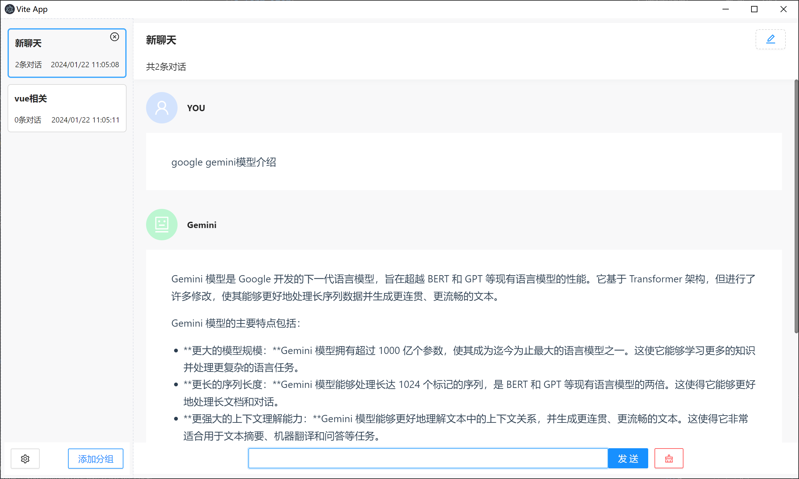

<!--
 * @Descripttion: 
 * @version: 
 * @Author: lc
 * @Date: 2023-12-12 09:12:11
 * @LastEditors: lc
 * @LastEditTime: 2024-01-30 11:08:40
-->
# 基于Google gemini API的聊天客户端

## 使用技术介绍

vue3+ts+vite+pinia搭建项目，使用ant-design组件库，搭建页面
聊天数据使用pinia缓存，未做数据持久化处理，刷新页面，数据会丢失，后续会使用数据持久化保存聊天数据
<br/>

## 运行效果图



## 功能介绍

- [x] 聊天分组增删改
- [x] 调用gemini API，与gemini聊天
- [x] 删除分组下的聊天记录
- [x] 缓存聊天数据
- [x] gemini流式输出
- [x] “设置”功能，包含设置API key、模型、Top K、Top P等功能
- [ ] 中断聊天 功能

## 项目运行

```javascript
/*注意事项
使用gemini API前，需要先申请google gemini key，
申请地址：https://makersuite.google.com/app/apikey，api key免费申请，
申请成功后，将api key复制到设置弹框的apiKey输入框中
*/

//克隆项目
 git clone https://github.com/echo-scorpio/geminiClient.git
//安装依赖
npm install
//运行
npm run dev
//打包
npm run build

```

## 使用electron打包为桌面程序

```javascript
//1、克隆electron-quick-start项目
https://github.com/electron/electron-quick-start.git
//2、安装依赖
npm install
//3、将geminiClient打包好的dist包，放在electron-quick-start项目的根目录下
//4、替换electron-quick-startmain.js中的index.html入口位置
    mainWindow.loadFile('./dist/index.html')  
//5、删除根目录下的index.html
//6、运行项目
npm run start
//7、打包为.exe程序 (参考链接：https://www.electronjs.org/zh/docs/latest/tutorial/%E6%89%93%E5%8C%85%E6%95%99%E7%A8%8B)
  npm install --save-dev @electron-forge/cli
  npx electron-forge import
  npm run make
```

  <br/>
  
  <br/>
  
  